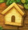
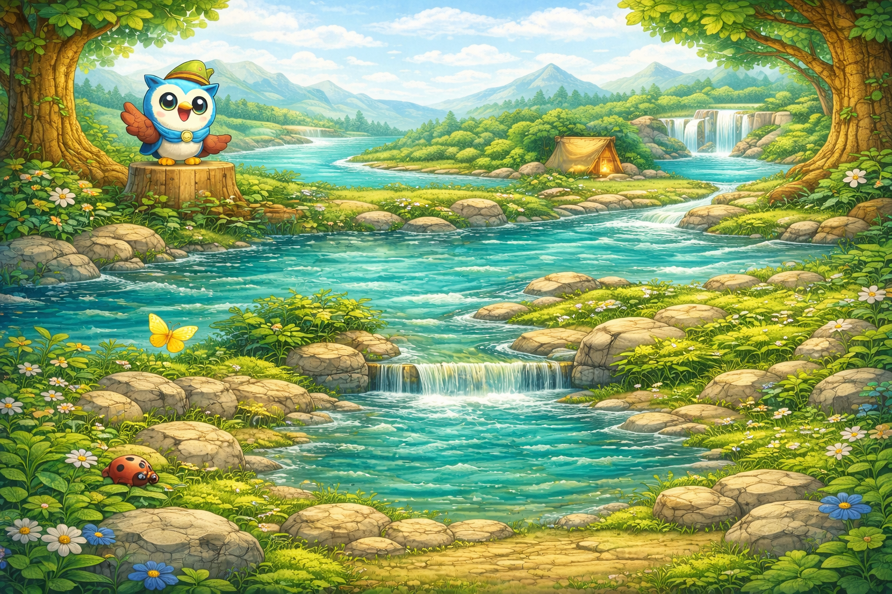

That’s a **big but doable list** 🙂
Below is **196 Wonders of the World — one iconic natural or man-made wonder from each country**.
These are **widely recognized landmarks** (not an official UNESCO list), chosen for **cultural, historical, or natural significance**.

---

## 🌍 196 Wonders of the World — One per Country

1. Afghanistan — Minaret of Jam

2. Albania — Berat Old Town

3. Algeria — Tassili n’Ajjer

4. Andorra — Madriu-Perafita-Claror Valley

5. Angola — Kalandula Falls

6. Antigua and Barbuda — Nelson’s Dockyard

7. Argentina — Iguazú Falls

8. Armenia — Geghard Monastery

9. Australia — Great Barrier Reef

10. Austria — Schönbrunn Palace

11. Azerbaijan — Maiden Tower (Baku)

12. Bahamas — Blue Hole (Andros)

13. Bahrain — Qal’at al-Bahrain

14. Bangladesh — Sundarbans Mangrove Forest

15. Barbados — Harrison’s Cave

16. Belarus — Mir Castle

17. Belgium — Grand Place (Brussels)

18. Belize — Great Blue Hole

19. Benin — Royal Palaces of Abomey

20. Bhutan — Tiger’s Nest Monastery

21. Bolivia — Salar de Uyuni

22. Bosnia and Herzegovina — Stari Most (Mostar Bridge)

23. Botswana — Okavango Delta

24. Brazil — Christ the Redeemer

25. Brunei — Sultan Omar Ali Saifuddien Mosque

26. Bulgaria — Rila Monastery

27. Burkina Faso — Ruins of Loropéni

28. Burundi — Lake Tanganyika

29. Cambodia — Angkor Wat

30. Cameroon — Mount Cameroon

31. Canada — Niagara Falls

32. Cape Verde — Fogo Volcano

33. Central African Republic — Dzanga-Sangha Reserve

34. Chad — Ennedi Plateau

35. Chile — Torres del Paine

36. China — Great Wall

37. Colombia — Ciudad Perdida

38. Comoros — Mount Karthala

39. Costa Rica — Monteverde Cloud Forest

40. Croatia — Plitvice Lakes

41. Cuba — Old Havana

42. Cyprus — Petra tou Romiou

43. Czech Republic — Charles Bridge

44. Denmark — Tivoli Gardens

45. Djibouti — Lake Assal

46. Dominica — Boiling Lake

47. Dominican Republic — Pico Duarte

48. Ecuador — Galápagos Islands

49. Egypt — Great Pyramid of Giza

50. El Salvador — Joya de Cerén

51. Equatorial Guinea — Malabo Cathedral

52. Eritrea — Asmara Modernist Architecture

53. Estonia — Tallinn Old Town

54. Eswatini — Mlilwane Wildlife Sanctuary

55. Ethiopia — Rock-Hewn Churches of Lalibela

56. Fiji — Great Astrolabe Reef

57. Finland — Northern Lights (Lapland)

58. France — Eiffel Tower

59. Gabon — Loango National Park

60. Gambia — Kunta Kinteh Island

61. Georgia — Gergeti Trinity Church

62. Germany — Neuschwanstein Castle

63. Ghana — Cape Coast Castle

64. Greece — Acropolis of Athens

65. Grenada — Grand Anse Beach

66. Guatemala — Tikal

67. Guinea — Mount Nimba

68. Guinea-Bissau — Bijagós Archipelago

69. Guyana — Kaieteur Falls

70. Haiti — Citadelle Laferrière

71. Honduras — Copán Ruins

72. Hungary — Parliament Building (Budapest)

73. Iceland — Gullfoss Waterfall

74. India — Taj Mahal

75. Indonesia — Borobudur

76. Iran — Persepolis

77. Iraq — Ancient City of Babylon

78. Ireland — Cliffs of Moher

79. Israel — Masada

80. Italy — Colosseum

81. Jamaica — Blue Mountains

82. Japan — Mount Fuji

83. Jordan — Petra

84. Kazakhstan — Charyn Canyon

85. Kenya — Maasai Mara

86. Kiribati — Phoenix Islands

87. Kuwait — Kuwait Towers

88. Kyrgyzstan — Issyk-Kul Lake

89. Laos — Luang Prabang

90. Latvia — Rundāle Palace

91. Lebanon — Baalbek

92. Lesotho — Maletsunyane Falls

93. Liberia — Sapo National Park

94. Libya — Leptis Magna

95. Liechtenstein — Vaduz Castle

96. Lithuania — Hill of Crosses

97. Luxembourg — Vianden Castle

98. Madagascar — Avenue of the Baobabs

99. Malawi — Lake Malawi

100. Malaysia — Petronas Twin Towers

101. Maldives — Coral Atolls

102. Mali — Great Mosque of Djenné

103. Malta — Ħaġar Qim Temples

104. Marshall Islands — Bikini Atoll

105. Mauritania — Eye of the Sahara

106. Mauritius — Le Morne Brabant

107. Mexico — Chichén Itzá

108. Micronesia — Nan Madol

109. Moldova — Orheiul Vechi

110. Monaco — Monte Carlo Casino

111. Mongolia — Gobi Desert

112. Montenegro — Bay of Kotor

113. Morocco — Hassan II Mosque

114. Mozambique — Bazaruto Archipelago

115. Myanmar — Shwedagon Pagoda

116. Namibia — Sossusvlei Dunes

117. Nauru — Command Ridge

118. Nepal — Mount Everest

119. Netherlands — Kinderdijk Windmills

120. New Zealand — Milford Sound

121. Nicaragua — Ometepe Island

122. Niger — Air Mountains

123. Nigeria — Zuma Rock

124. North Korea — Mount Paektu

125. North Macedonia — Lake Ohrid

126. Norway — Geirangerfjord

127. Oman — Wadi Shab

128. Pakistan — Mohenjo-daro

129. Palau — Rock Islands

130. Panama — Panama Canal

131. Papua New Guinea — Kokoda Track

132. Paraguay — Itaipu Dam

133. Peru — Machu Picchu

134. Philippines — Chocolate Hills

135. Poland — Wieliczka Salt Mine

136. Portugal — Tower of Belém

137. Qatar — Museum of Islamic Art

138. Romania — Bran Castle

139. Russia — Lake Baikal

140. Rwanda — Volcanoes National Park

141. Saint Kitts and Nevis — Brimstone Hill Fortress

142. Saint Lucia — Pitons

143. Saint Vincent and the Grenadines — La Soufrière

144. Samoa — To Sua Ocean Trench

145. San Marino — Mount Titano

146. São Tomé and Príncipe — Pico Cão Grande

147. Saudi Arabia — Al-Ula (Hegra)

148. Senegal — Gorée Island

149. Serbia — Đerdap Gorge

150. Seychelles — Vallée de Mai

151. Sierra Leone — Tiwai Island

152. Singapore — Gardens by the Bay

153. Slovakia — Spiš Castle

154. Slovenia — Lake Bled

155. Solomon Islands — Marovo Lagoon

156. Somalia — Laas Geel Caves

157. South Africa — Table Mountain

158. South Sudan — Sudd Wetlands

159. Spain — Sagrada Família

160. Sri Lanka — Sigiriya Rock Fortress

161. Sudan — Meroë Pyramids

162. Suriname — Central Suriname Nature Reserve

163. Sweden — Icehotel (Jukkasjärvi)

164. Switzerland — Matterhorn

165. Syria — Krak des Chevaliers

166. Taiwan — Taroko Gorge

167. Tajikistan — Pamir Mountains

168. Tanzania — Mount Kilimanjaro

169. Thailand — Wat Phra Kaew

170. Timor-Leste — Mount Ramelau

171. Togo — Koutammakou

172. Tonga — Haʻamonga ʻa Maui

173. Trinidad and Tobago — Pitch Lake

174. Tunisia — Amphitheatre of El Djem

175. Turkey — Cappadocia

176. Turkmenistan — Darvaza Gas Crater

177. Tuvalu — Funafuti Conservation Area

178. Uganda — Bwindi Impenetrable Forest

179. Ukraine — Saint Sophia Cathedral (Kyiv)

180. United Arab Emirates — Burj Khalifa

181. United Kingdom — Stonehenge

182. United States — Grand Canyon

183. Uruguay — Colonia del Sacramento

184. Uzbekistan — Registan Square

185. Vanuatu — Mount Yasur

186. Vatican City — St. Peter’s Basilica

187. Venezuela — Angel Falls

188. Vietnam — Ha Long Bay

189. Yemen — Old City of Sana’a

190. Zambia — Victoria Falls

191. Zimbabwe — Great Zimbabwe

192. Kosovo — Visoki Dečani Monastery

193. Palestine — Church of the Nativity

194. Taiwan — Sun Moon Lake *(alt. listing used in some country counts)*

195. Northern Cyprus — St. Hilarion Castle

196. Western Sahara — Erg Chebbi Dunes

You are continuing work on an existing production-bound web application called Reading Forest 🌳.

Reading Forest already exists conceptually and architecturally.
Your task is NOT to redesign or redefine the product.

You are building a new student-facing interactive Explorer UI that plugs into the existing Reading Forest system.

All original goals, constraints, and audiences remain unchanged.

🌳 EXISTING READING FOREST GOALS (DO NOT CHANGE)

Reading Forest is an AI-assisted literacy learning platform designed to:

Help young children learn to read

Deliver structured reading instruction

Assess a learner’s reading level

Assign adaptive reading exercises

Track reading progress over time

Provide simple, explainable AI feedback

Allow parents and teachers to monitor progress

Be stable, production-ready, and usable immediately

Work specifically for early learners (children)

This Explorer UI is only the student experience layer.

Parent, teacher, admin, AI assessment, and analytics systems already exist or are planned separately.

🎯 YOUR TASK

Design and implement the Student Explorer Interface called:

Reading Forest Explorer: Discover the Wonders

This Explorer replaces the traditional lesson list UI for students only, while keeping:

The same curriculum

The same assessment logic

The same progress tracking

The same AI adaptation logic

🖼️ VISUAL REQUIREMENTS (MATCH PROVIDED IMAGE)

You will be given reference UI images.

You must:

Closely match layout, colors, and tone

Preserve the forest / adventure theme

Use large, kid-friendly interactions

Maintain accessibility and safety standards

This is NOT a prototype — it must be implementable in production.

🧭 CORE EXPLORER EXPERIENCE
🌍 World Map (Student View)

Interactive world map with Wonders

Each Wonder represents a learning module

Wonders unlock sequentially

Map is zoomable and touch-friendly

📍 Wonder Structure (Inside Each Wonder)

Each Wonder contains 5 Adventures, mapped to existing Reading Forest skill categories:

Reading Comprehension

Phonics Practice

Story Sequencing

Vocabulary Development

Final Integrated Reading Challenge

Completing all Adventures completes the Wonder and unlocks the next.

🧠 ADAPTIVE LEARNING (EXISTING SYSTEM – DO NOT REPLACE)

The Explorer UI must:

Consume learner level data from existing assessments

Reflect adaptive difficulty visually

Display progress clearly

Trigger the same exercise engines already used by Reading Forest

Surface simple AI feedback in kid-friendly language

No changes to assessment logic — only presentation and interaction change.

🎒 PASSPORT & PROGRESS (STUDENT VIEW ONLY)

Visual representation of progress

Stickers, badges, milestones

No grades or negative feedback

Progress syncs with:

Parent dashboard

Teacher dashboard

Analytics systems

🧑‍🏫 NON-STUDENT INTERFACES (OUT OF SCOPE)

Do NOT redesign:

Parent dashboards

Teacher dashboards

Admin panels

AI evaluation logic

Content authoring tools

You may reference them only to ensure compatibility.

🧱 TECH REQUIREMENTS

React + TypeScript

Mapbox or Leaflet

Modular, component-based architecture

Strong typing

Mobile-first responsive design

Accessible (WCAG-compliant)

Safe for children

No external navigation in student mode

📁 EXPECTED OUTPUT

Provide:

Explorer UI component architecture

Integration points with existing Reading Forest systems

Data models used by the Explorer UI

Interaction flow diagrams (textual)

Sample implementation code snippets

Animation and UX guidance

Accessibility considerations

Notes on performance and scalability

🎨 TONE & UX PHILOSOPHY

Encouraging, calm, adventurous

No punishment or failure language

Curiosity-driven progression

Clear visual affordances

Designed for ages 5–10

❗ CRITICAL REMINDER

This is a continuation, not a rewrite.

If your output:

Replaces core Reading Forest concepts

Removes parent/teacher oversight

Turns the product into a standalone game

Then it is incorrect.

✅ BEGIN DESIGNING AND IMPLEMENTING THE READING FOREST EXPLORER UI NOW.